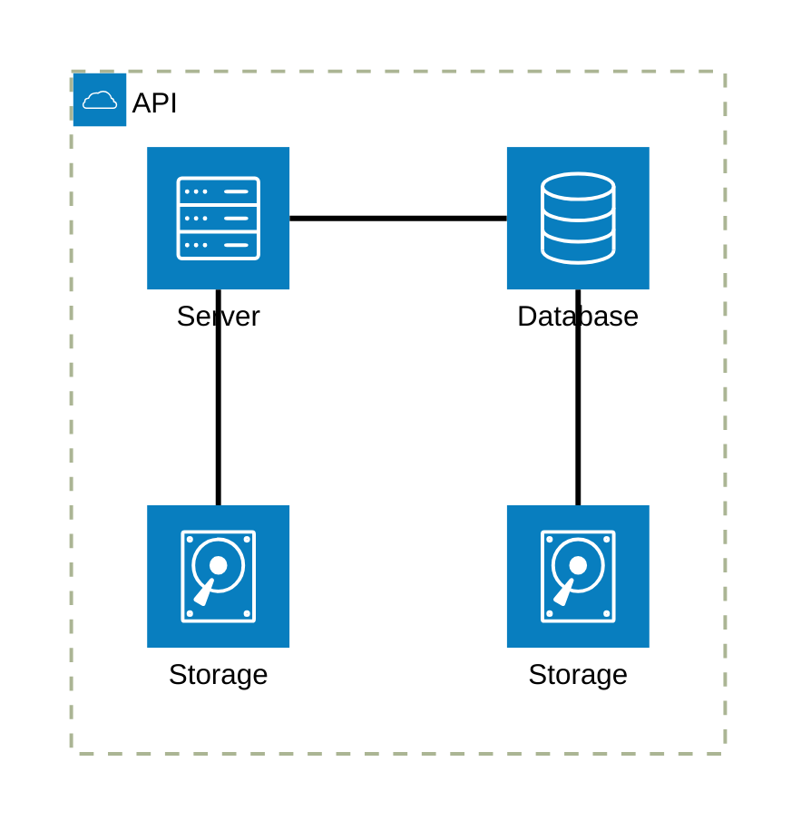

# docker-comfyui
Docker image for Comfyui

## Mermaid

```mermaid
---
config:
  look: handDrawn
  theme: forest
---
architecture-beta
    group api(cloud)[API]

    service db(database)[Database] in api
    service disk1(disk)[Storage] in api
    service disk2(disk)[Storage] in api
    service server(server)[Server] in api

    db:L -- R:server
    disk1:T -- B:server
    disk2:T -- B:db
```
